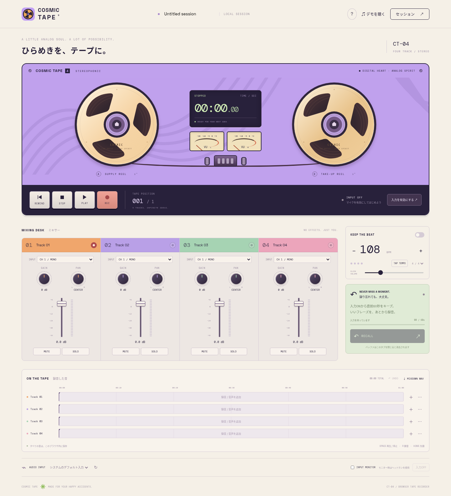

# COSMIC TAPE

サイケデリックなオープンリール風の、4トラック・ブラウザMTRです。
左右のリールが再生・録音に連動して回転し、エフェクトなしで録音とミックスを楽しめます。



## 機能

- 4トラックの録音・再生・重ね録り
- トラックごとの入力チャンネル、ソフトウェアゲイン、PAN、音量フェーダー
- 録音待機、MUTE、SOLO
- BPM指定・タップテンポ・拍子・クリック音量付きメトロノーム
- 入力ON中の直前60秒を呼び戻すリコール録音
- 音声ファイルの読み込み、48kHz / 16bitステレオWAVミックス書き出し
- ブラウザ内への自動保存、`.cosmictape` セッションファイルの保存・読み込み
- テープリールのアイコン、アプリ表示用Web App Manifest

EQ・エフェクトプラグインは使用しません。音声処理と保存はブラウザ内で行い、録音データをサーバーにアップロードする処理はありません。

## GitHub Pagesで公開

1. このリポジトリをGitHubにアップロードします。新規リポジトリは **Public**、ブランチ名は **main** にします。
2. リポジトリの **Settings → Pages → Build and deployment → Source** を **GitHub Actions** に変更します。
3. **Actions → Deploy COSMIC TAPE to GitHub Pages → Run workflow** を実行します。
4. ワークフローが成功すると、**Settings → Pages** に公開URLが表示されます。

以後は `main` に変更をpushすると、自動で公開内容が更新されます。
通常のURLは `https://<GitHubユーザー名>.github.io/<リポジトリ名>/` です。
必要なCSS・フォント・画像は同梱しています。サーバーやAPIキー、npmパッケージのインストールは不要です。

初回アップロードの手順は [GitHub公開ガイド](docs/GITHUB-PUBLISH.md) を参照してください。

## Macでローカル起動

Python 3が入っている場合、リポジトリのフォルダで次を実行します。

```sh
python3 -m http.server 8000 --directory dist
```

Chromeで `http://localhost:8000/` を開きます。終了はターミナルで `Control + C`。
`index.html` を直接開くのではなく、localhostまたはHTTPSで利用してください。

## 録音する

1. **入力を有効にする** を押し、ブラウザのマイク利用を許可します。
2. **AUDIO INPUT** でMacBookのマイク、または接続したオーディオインターフェースを選びます。
3. 録音したいトラック右上の **赤い●** をONにします。
4. **INPUT** で入力チャンネル、**GAIN** で入力ゲインを選び、**REC** で録音、**STOP** で停止します。
5. PAN・音量を調整し、**MIXDOWN WAV** で書き出します。

別トラックを録音待機にすると、既存のトラックを聴きながら重ね録りできます。
テープ上をクリックして録音・再生位置を選べます。
**デモを聴く** で、マイクなしでも4トラックのミックスを試せます。

## リコール録音

入力を有効にした時点から、直前60秒の入力音を一時的に保持します。
録音ボタンを押し忘れたときは **RECALL** で、秒数と保存先トラックを選んで追加してください。
呼び戻し時のゲインを適用し、現在のテープ位置にテイクを追加します。
マイク許可以前や入力OFF中の音は回収できません。タブを閉じるとリコールバッファは消去されます。

## 対応と制限

- デスクトップ版Chromeを推奨。マイクを使うにはHTTPSまたはlocalhost、ブラウザ・macOSのマイク許可が必要です。
- インターフェースの入力チャンネル数は、ブラウザが公開する範囲です。4トラックは4つのハードウェア入力を保証するものではありません。
- GAINはソフトウェアゲインです。機器のプリアンプ・物理ゲインはインターフェース側で設定してください。
- 入力モニターやメトロノームを使用する際は、ヘッドホンを使ってください。
- 1回の録音は最大10分、音声ファイルの取り込みは10分・150MB以下です。
- 自動保存は同じブラウザ・同じサイト内の1セッションです。別の公開URLに移るときはセッションファイルを保存・読み込みしてください。
- セッションファイル内の音声は16bitモノラルWAVで保存します。ブラウザの保存領域消去やプライベートモードに備え、大切なセッションはファイル保存してください。
- タブの休止・スリープ・OSやブラウザの制限により、バックグラウンド録音が中断されることがあります。
- Chromiumの模擬マイクで録音・重ね録り・リコール・復元・書き出しを確認済みです。MacBookと外部インターフェースの実機テストは未実施です。

## ファイル構成

```text
dist/                  公開するアプリ本体
  index.html           デッキ・ミキサー画面
  style.css            レトロなUI
  app.js               画面操作・保存・メトロノーム
  audio.js             録音・ミックス・リコール・WAV
  capture-worklet.js   音声入力のPCM収集
  sw.js                静的アセットのキャッシュ
  fonts/               フォントとOFLライセンス
.github/workflows/     GitHub Pages自動公開
```

## 開発時のチェック

Node.js 22以上がある場合：

```sh
npm run check
```

## ライセンス

アプリ本体は [MIT License](LICENSE) です。
同梱フォントのSpace Grotesk・DM MonoはSIL Open Font License 1.1です。
ライセンス本文は `dist/fonts/` に収録しています。
